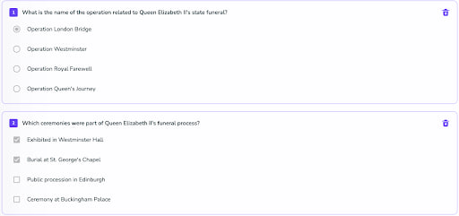

<!--truncate-->

<!--truncate-->

# I. Introduction

In the quickly expanding area of educational technology, Generative AI is a leading example of new ideas. It is changing the usual ways of teaching and testing. This new technology can make learning more tailored to each person and make creating educational materials much simpler than before.

This article will explain what Generative AI is, look at how it can be used to make good test questions, explore how it can help students learn better, and finally, think about how to use it responsibly in education.

# II. What is Generative AI?

Generative AI refers to a subset of artificial intelligence technologies capable of generating new content, from text and images to data patterns, based on the learning from vast amounts of existing data. Unlike traditional AI, which is designed to follow explicit instructions, Generative AI adopts a more creative approach, using algorithms like Generative Adversarial Networks (GANs) and transformers to produce original, contextually relevant material.

In the educational sphere, Generative AI has begun to make its mark, offering tools that can generate rich, diverse educational content, including quizzes, illustrative diagrams, and even explanatory paragraphs. These tools not only assist in creating formative assessments but also in developing customized learning materials that cater to the needs of every student.

How does generative AI work from teacher prosperity

# III. Generative AI in Creating Assessment Questions

Using Generative AI to create test questions is a big improvement in how we teach. This technology can make all kinds of questions, like multiple-choice, fill-in-the-blanks, and even tougher ones that make students think hard. Teachers just need to tell the AI what topics to cover and how tough the questions should be. Then, the AI can make a bunch of different questions that really test if students understand the material.

One of the best things about Generative AI in education is how it can make tests that help students learn, not just show what they already know. It can make questions and give feedback that's just right for each student. This means teaching can be more flexible, changing quickly to match how students are doing and keeping them interested.

An example of questions created by AI, which were generated in 10 seconds.

# IV. Enhancing the Student Experience with Generative AI

Generative AI isn't just making things easier for teachers; it's transforming how students learn. Here's how it's making a difference:

## Personalized Learning Journeys:
- **Pace**: Students learn at their own speed.
- **Preferences**: The content matches what students like and how they prefer to learn.
- **Improvement Areas**: It focuses on topics where the student needs more help.

## Immediate Feedback:
- Students get quick responses to their answers.
- Feedback can clarify mistakes, suggest extra resources, or confirm correct answers.

## Adaptive Learning:
- The AI adjusts the learning path based on how students respond to questions and interact with the material.
- It keeps the learning challenging but achievable, improving both outcomes and personal growth.

This tailored approach makes learning more engaging and effective, helping students feel supported and encouraging them to reach their full potential. Instant feedback promotes active learning and cuts down on frustration from waiting, letting students move forward at their own pace.

## V. Responsible Use of AI in Education

As we start to use Generative AI in education more, it's really important to think about using it the right way. Here's what needs to be done to make usage of AI fair and safe:

### Checking the AI's Work:
- We need to make sure that what the AI creates is correct and suitable for students. Teachers and tech companies have to work together to check the AI's content for mistakes, biases, or anything that's not right for the student's age.

### Keeping Teachers in the Picture:
- Even with AI, we can't forget how important teachers are. They're needed for things like understanding how students feel and guiding them in ways AI can't. The main aim of using AI is to help with the routine stuff and make learning more personal, but not to take away the valuable human connection in teaching.

### Being Open About How AI is Used:
- It's also key to be clear with students and their families about how AI is being used in their education. This includes how data about them is collected and kept safe. Since we're often dealing with young people, being really careful with their information is a must to make sure the good things about using AI don't come with risks to their privacy or freedom.

# VI. Conclusion

Generative AI can really change education by making it more tailored and interesting for students. It does this by creating different kinds of questions, giving quick feedback, and adjusting to each student's learning needs. However, as we start using Generative AI more, we need to be careful about using it right. We have to think about ethical issues and keep the important human touch in teaching. Moving ahead, it's important for teachers, tech experts, students, and leaders to talk about how to use Generative AI well, making sure it helps in reaching great educational goals.

