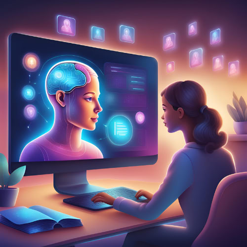

<!--truncate-->

<!--truncate-->

# How to Use AI Quiz for Personalized Learning

Like all other domains of life, the education landscape is inevitably undergoing an AI revolution. AI-powered learning tools are transforming traditional learning methods by creating personalized experiences for students. This article delves into the exciting potential of AI quizzes for personalized learning.

## Personalized learning AI platforms: tailoring education to the individual

Picture a dedicated teacher in a classroom bustling with 30 students. Each student learns at their own pace, some grasping concepts quickly, while others grapple with fundamental ideas. The teacher strives to cater to these individual needs, but the reality of a large class size can feel like trying to fit square pegs into round holes. Here's where AI platforms enter the scene: imagine a classroom where every student receives tailored learning experiences with AI. This is the promise of personalized learning, and AI platforms are revolutionizing how we achieve it. Learn more about educational platforms that use AI in adaptive learning:

### AI-Powered Quizzes:
- **Hearify.org** is an [AI-powered quiz generator](https://hearify.org) that can create quizzes from various sources, including PDFs, videos, and text. This allows teachers to create assessments that are directly related to the learning material easily. Hearify can be useful for educators looking to incorporate quizzes into their teaching.
- **Quizlet** leverages AI technology to streamline quiz creation. Beyond generating questions, it offers tools like digital flashcards and practice quizzes. This versatility makes Quizlet a popular choice for educators and students alike.
- **Socrative** stands out by turning assessments into engaging activities with the power of AI. Educators create quizzes, polls, and games, all while receiving real-time student feedback.

### Adaptive Learning Platforms:
- **Khan Academy** offers teachers AI-powered tools to personalize learning. Teachers can adjust difficulty levels, create custom lesson plans, and group students efficiently. This saves teachers valuable time (an average of 5 hours a week) and allows them to focus on what matters most: their students.
- **DreamBox** personalizes math learning with AI. It tracks individual student styles and adjusts lessons accordingly, ensuring each student gets the right challenge level and builds confidence. This individualized approach helps students progress faster and retain information better.
- **IXL Learning** uses AI to provide businesses and schools with faster, more accurate ways to assess language abilities. This can help personalize language learning for students.

### Intelligent Tutoring Systems:

These leverage AI to simulate a one-on-one tutoring experience. They can answer questions, provide feedback, and guide learners through the material. (e.g., chatbots powered by NLP)
- **Aleks.** This web-based system leverages AI to create a customized learning path for each student. Unlike traditional platforms, ALEKS utilizes "Knowledge Space Theory" to map a student's knowledge in granular detail. This allows ALEKS to identify topics a student is ready to learn and present them with targeted practice problems, fostering efficient learning and building confidence.
- **Knewton:** This platform employs AI to guide students through complex concepts. It analyzes a student's performance and curates personalized lesson plans from a vast pool of educational content. Knewton tailors the learning pace and difficulty to a student's needs, ensuring mastery of learning objectives. This approach is particularly beneficial for students who struggle in traditional settings, allowing them to progress at their own pace and achieve success.

These are just a few examples, and the best platform will depend on your specific needs and preferences. When making your choice, consider factors like features, cost, and target age group.

## AI for personalized learning: benefits for students and educators

The one-size-fits-all approach to quizzes is a thing of the past. AI-powered quizzes are revolutionizing assessment, creating a dynamic learning experience that benefits both students and educators.

### Students Unlock Their Potential:
- **Master Key Concepts:** AI identifies knowledge gaps and generates targeted questions to solidify understanding and retention. This targeted approach ensures students master key concepts before moving on, leading to a deeper grasp of the material.
- **Interactive Learning Adventure:** Diverse question formats, multimedia elements, and immediate feedback keep students engaged and motivated. This sense of autonomy and control over the learning process fosters a love for exploration and discovery.
- **Boosted Confidence:** AI quizzes acknowledge strengths while pinpointing areas for growth. This constructive feedback builds confidence and allows students to approach challenges with a positive mindset, fostering a growth mentality essential for academic success.

### Educators Gain Valuable Insights:
- **Reduced Workload:** AI automates quiz creation and grading, freeing up time for personalized instruction. 
- **Data-Driven Decisions:** AI provides educators with a wealth of data on student progress. By analyzing student performance on AI quizzes, educators clearly understand individual learning gaps and class-wide trends. This allows teachers to tailor instruction and identify areas needing support. 
- **Differentiation Made Easy:** Differentiation, the art of catering to diverse learning styles, has always been a challenge in large classrooms. AI personalizes learning paths for each student, making differentiation in large classrooms more manageable.

By empowering students and equipping educators with valuable insights, AI paves the way for a future of personalized learning that is not just standardized but truly transformative.

## AI personalized learning: learn with AI-powered adaptive quizzes

Traditionally, education followed a one-size-fits-all approach, delivering the same curriculum and pace to every student regardless of their learning styles or individual needs. Now, AI analyzes a wealth of student data, including quiz performance, learning styles gleaned from interactions with the platform, and progress tracking. By examining this data, AI platforms can accurately identify a student's strengths and weaknesses. This allows teachers to create targeted learning paths that address specific knowledge gaps and build upon existing strengths.

The magic lies in the specific functionalities AI brings to personalized learning quizzes. Here's how AI tailors the learning experience:
1. **Adaptive Question Difficulty:** AI adjusts the difficulty of questions on the fly. Students who struggle with a concept will encounter follow-up questions designed to solidify their understanding. Conversely, those who excel will be challenged with more complex questions to keep them engaged and push their learning further.
2. **Multiple Answer Formats:** Learning styles differ. AI recognizes this and generates quizzes with diverse question formats. Multiple choice, fill-in-the-blank, matching, and even open-ended questions cater to visual, auditory, and kinesthetic learners, ensuring everyone can demonstrate their understanding in a way that resonates with them.

AI personalizes learning by transforming quizzes from static assessments into dynamic roadmaps to knowledge. This newfound ability to tailor the learning experience to the individual unlocks a future brimming with possibilities. Imagine a classroom where every student progresses at their own pace, is challenged yet supported, nurtured in their strengths, and empowered to overcome weaknesses. This is the transformative potential of AI in education, and it's a future that is rapidly becoming a reality.

## Personalized learning with AI: putting AI quizzes to practice
Now that you understand the benefits of AI-powered quizzes let's explore how to leverage this technology in your classroom.
### Choosing an AI-powered quizzing platform
Selecting the right platform is crucial for a seamless AI-powered learning experience. Here are key factors to consider:
1. **Features Offered:** Look for platforms that provide adaptive difficulty, automatically adjusting question complexity based on student performance. Diverse question formats, like multiple choice, fill-in-the-blank, and open-ended, cater to different learning styles. Additionally, detailed student performance reports offer valuable insights into strengths, weaknesses, and areas requiring further explanation.
2. **Ease of Use:** A user-friendly interface is essential. Educators should be able to create, edit, and administer quizzes easily. The platform should offer students a clear and intuitive interface for taking quizzes and receiving feedback.
3. **Integration with Existing LMS:** Choosing a platform that integrates seamlessly with your school's Learning Management System (LMS) streamlines workflow. This allows for centralized data storage, easy access to quizzes for students, and effortless grade integration.

### Creating effective AI quizzes
Once you've chosen your personalized learning technology, here are some tips for crafting effective AI quizzes:
1. **Clear Learning Objectives:**  Start by defining specific learning objectives for each quiz. This ensures the quiz focuses on key concepts and accurately reflects student understanding.
2. **Variety in Questions:**  Incorporate a mix of question formats. Multiple choice tests factual knowledge, while open-ended prompts encourage critical thinking and analysis. Matching exercises assess comprehension and fill-in-the-blanks solidify key terms. This variety caters to diverse learning styles and provides a more comprehensive assessment.
3. **Providing Feedback:** Immediate feedback is vital for reinforcing learning and addressing misconceptions. Choose a platform that offers immediate feedback after quizzes, highlighting correct answers, explaining wrong ones, and providing additional resources for clarification.

By following these guidelines, you can transform AI-powered quizzes from simple assessments into dynamic learning tools that personalize and enhance the educational experience for all students.

## AI and personalized learning: the future of education
While AI-powered quizzes offer a powerful step towards personalized learning, it's crucial to acknowledge potential challenges and ensure responsible implementation.

### Challenges and considerations:
- **Bias in AI algorithms:**  AI is only as good as the data it's trained on. Biases in datasets can lead to unfair quizzes that disadvantage certain students. To mitigate this, educators should choose platforms that prioritize diverse data sets and regularly evaluate quizzes for potential bias.
- **Overreliance on technology:** AI should be a tool, not a replacement for human interaction in the classroom. Educators should use AI quizzes to inform instruction, not eliminate the irreplaceable value of personalized guidance and support.
- **Data privacy:**  Student data privacy is paramount. Educators should choose platforms with robust security measures that comply with all data privacy regulations. Transparency is key – students and parents should be informed about how data is collected and used.

### The future of AI in education
The potential of AI for individualized learning extends far beyond ChatGPT conversations. Here's a glimpse into the exciting possibilities that lie ahead:

- **Personalized learning paths:** Imagine an educational experience that dynamically adapts to each student's needs throughout their academic journey. AI could analyze a student's strengths, weaknesses, and learning style to create a personalized roadmap, recommending resources and activities that optimize their learning trajectory.
- **Immersive learning experiences:** AI has the potential to power immersive learning experiences that go beyond traditional textbooks and lectures. Imagine simulations that allow students to virtually explore historical events or personalized games that make learning core concepts engaging and interactive.
- **Empowering educators:** AI can be a powerful tool for educators, providing them with data-driven insights into student progress. This allows them to personalize instruction, identify at-risk students early, and tailor their teaching approach to maximize student engagement and achievement. Ultimately, AI can empower educators to become more effective guides on each student's unique learning journey.

In conclusion, AI holds immense potential to personalize and revolutionize education. By acknowledging the challenges and implementing AI responsibly, educators can unlock a future where learning is not just standardized but truly transformative, engaging, and empowering for all students.

## FAQ
### How to use AI in personalized learning?
AI can be a game-changer for personalized learning. Imagine a virtual tutor that adjusts difficulty, recommends resources, and offers targeted feedback just for you! This is achieved through adaptive learning technologies and AI-powered quiz generators like Hearify. These analyze your strengths, weaknesses, and learning pace to create a customized path that keeps you challenged and engaged. It's like having a personal study guide constantly adapting to your needs.
### Can AI create quizzes?
Yes, AI can help create quizzes. Tools like Hearify use AI to analyze text and generate multiple-choice and single-choice questions, fill-in, matching, and open questions. This saves time and effort, but you may still need to edit the questions for clarity.
### How AI promote personalization and better learning outcomes?
AI crafts adaptive learning paths that match a student's pace and strengths, offers personalized education solutions like quizzes or intelligent tutoring that adjust to their understanding, and analyzes data to pinpoint areas needing extra attention. This empowers students to learn effectively and equips teachers to provide targeted support.
### How AI helps in giving you a personalized experience online?
AI personalizes online learning by creating adaptive experiences. It analyzes your progress, adjusts difficulty, and recommends resources, acting like a virtual tutor catering to your unique learning pace and needs.

